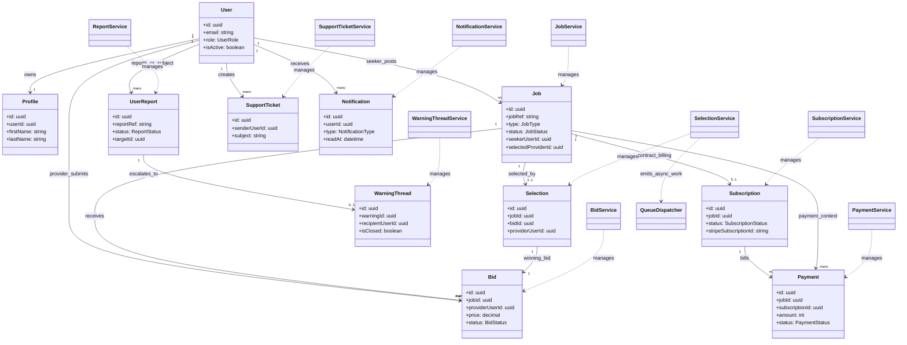

# Class Diagram

This class diagram focuses on primary domain entities and service boundaries used in the API app.

```mermaid
classDiagram
  class User {
    +id: uuid
    +email: string
    +role: UserRole
    +isActive: boolean
  }

  class Profile {
    +id: uuid
    +userId: uuid
    +firstName: string
    +lastName: string
  }

  class Job {
    +id: uuid
    +jobRef: string
    +type: JobType
    +status: JobStatus
    +seekerUserId: uuid
    +selectedProviderId: uuid
  }

  class Bid {
    +id: uuid
    +jobId: uuid
    +providerUserId: uuid
    +price: decimal
    +status: BidStatus
  }

  class Selection {
    +id: uuid
    +jobId: uuid
    +bidId: uuid
    +providerUserId: uuid
  }

  class Subscription {
    +id: uuid
    +jobId: uuid
    +status: SubscriptionStatus
    +stripeSubscriptionId: string
  }

  class Payment {
    +id: uuid
    +jobId: uuid
    +subscriptionId: uuid
    +amount: int
    +status: PaymentStatus
  }

  class UserReport {
    +id: uuid
    +reportRef: string
    +status: ReportStatus
    +targetId: uuid
  }

  class WarningThread {
    +id: uuid
    +warningId: uuid
    +recipientUserId: uuid
    +isClosed: boolean
  }

  class SupportTicket {
    +id: uuid
    +senderUserId: uuid
    +subject: string
  }

  class Notification {
    +id: uuid
    +userId: uuid
    +type: NotificationType
    +readAt: datetime
  }

  class JobService
  class BidService
  class SelectionService
  class PaymentService
  class SubscriptionService
  class ReportService
  class WarningThreadService
  class SupportTicketService
  class NotificationService
  class QueueDispatcher

  User "1" --> "1" Profile : owns
  User "1" --> "many" Job : seeker_posts
  User "1" --> "many" Bid : provider_submits
  Job "1" --> "many" Bid : receives
  Job "1" --> "0..1" Selection : selected_by
  Selection "1" --> "1" Bid : winning_bid
  Job "1" --> "0..1" Subscription : contract_billing
  Subscription "1" --> "many" Payment : bills
  Job "1" --> "many" Payment : payment_context

  User "1" --> "many" UserReport : reports_or_subject
  UserReport "1" --> "0..1" WarningThread : escalates_to
  User "1" --> "many" SupportTicket : creates
  User "1" --> "many" Notification : receives

  JobService ..> Job : manages
  BidService ..> Bid : manages
  SelectionService ..> Selection : manages
  SelectionService ..> QueueDispatcher : emits_async_work
  PaymentService ..> Payment : manages
  SubscriptionService ..> Subscription : manages
  ReportService ..> UserReport : manages
  WarningThreadService ..> WarningThread : manages
  SupportTicketService ..> SupportTicket : manages
  NotificationService ..> Notification : manages
```
