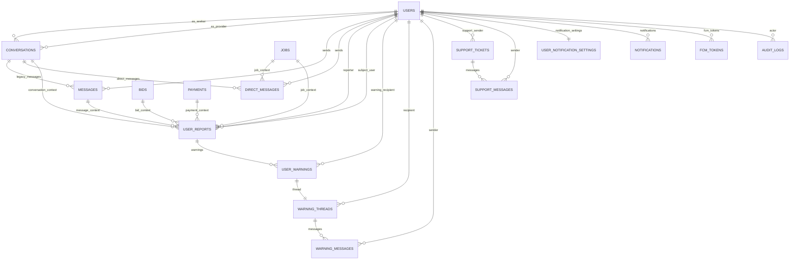

# ERD: Conversations, Moderation, Support, and Notifications (Entity-Based)

Source: TypeORM entity relations under `apps/api/src/database/entities`.

```mermaid
erDiagram
  USERS ||--o{ CONVERSATIONS : as_seeker
  USERS ||--o{ CONVERSATIONS : as_provider
  CONVERSATIONS ||--o{ MESSAGES : legacy_messages
  CONVERSATIONS ||--o{ DIRECT_MESSAGES : direct_messages
  USERS ||--o{ MESSAGES : sends
  USERS ||--o{ DIRECT_MESSAGES : sends
  JOBS ||--o{ DIRECT_MESSAGES : job_context

  USERS ||--o{ USER_REPORTS : reporter
  USERS ||--o{ USER_REPORTS : subject_user
  JOBS ||--o{ USER_REPORTS : job_context
  BIDS ||--o{ USER_REPORTS : bid_context
  CONVERSATIONS ||--o{ USER_REPORTS : conversation_context
  MESSAGES ||--o{ USER_REPORTS : message_context
  PAYMENTS ||--o{ USER_REPORTS : payment_context

  USER_REPORTS ||--o{ USER_WARNINGS : warnings
  USERS ||--o{ USER_WARNINGS : warning_recipient
  USER_WARNINGS ||--|| WARNING_THREADS : thread
  USERS ||--o{ WARNING_THREADS : recipient
  WARNING_THREADS ||--o{ WARNING_MESSAGES : messages
  USERS ||--o{ WARNING_MESSAGES : sender

  USERS ||--o{ SUPPORT_TICKETS : support_sender
  SUPPORT_TICKETS ||--o{ SUPPORT_MESSAGES : messages
  USERS ||--o{ SUPPORT_MESSAGES : sender

  USERS ||--|| USER_NOTIFICATION_SETTINGS : notification_settings
  USERS ||--o{ NOTIFICATIONS : notifications
  USERS ||--o{ FCM_TOKENS : fcm_tokens

  USERS ||--o{ AUDIT_LOGS : actor
```
