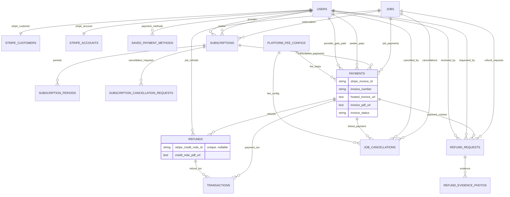

# ERD: Billing, Payments, and Refunds (Entity-Based)

Source: TypeORM entity relations under `apps/api/src/database/entities`.

```mermaid
erDiagram
  USERS ||--|| STRIPE_CUSTOMERS : stripe_customer
  USERS ||--|| STRIPE_ACCOUNTS : stripe_account
  USERS ||--o{ SAVED_PAYMENT_METHODS : payment_methods

  JOBS ||--o{ SUBSCRIPTIONS : subscription
  USERS ||--o{ SUBSCRIPTIONS : seeker
  USERS ||--o{ SUBSCRIPTIONS : provider

  SUBSCRIPTIONS ||--o{ SUBSCRIPTION_PERIODS : periods
  SUBSCRIPTIONS ||--o{ SUBSCRIPTION_CANCELLATION_REQUESTS : cancellation_requests

  JOBS ||--o{ PAYMENTS : job_payments
  SUBSCRIPTIONS ||--o{ PAYMENTS : subscription_payments
  USERS ||--o{ PAYMENTS : seeker_pays
  USERS ||--o{ PAYMENTS : provider_gets_paid
  PLATFORM_FEE_CONFIGS ||--o{ PAYMENTS : fee_basis

  PAYMENTS {
    string stripe_invoice_id
    string invoice_number
    text   hosted_invoice_url
    text   invoice_pdf_url
    string invoice_status
  }

  PAYMENTS ||--o{ REFUNDS : refunds
  JOBS ||--o{ REFUNDS : job_refunds

  REFUNDS {
    string stripe_credit_note_id "unique, nullable"
    text   credit_note_pdf_url
  }

  JOBS ||--o{ REFUND_REQUESTS : refund_requests
  PAYMENTS ||--o{ REFUND_REQUESTS : payment_context
  USERS ||--o{ REFUND_REQUESTS : requested_by
  USERS ||--o{ REFUND_REQUESTS : reviewed_by
  REFUND_REQUESTS ||--o{ REFUND_EVIDENCE_PHOTOS : evidence

  JOBS ||--o{ JOB_CANCELLATIONS : cancellations
  USERS ||--o{ JOB_CANCELLATIONS : cancelled_by
  PAYMENTS ||--o{ JOB_CANCELLATIONS : linked_payment
  PLATFORM_FEE_CONFIGS ||--o{ JOB_CANCELLATIONS : fee_config

  PAYMENTS ||--o{ TRANSACTIONS : payment_txn
  REFUNDS ||--o{ TRANSACTIONS : refund_txn
```
