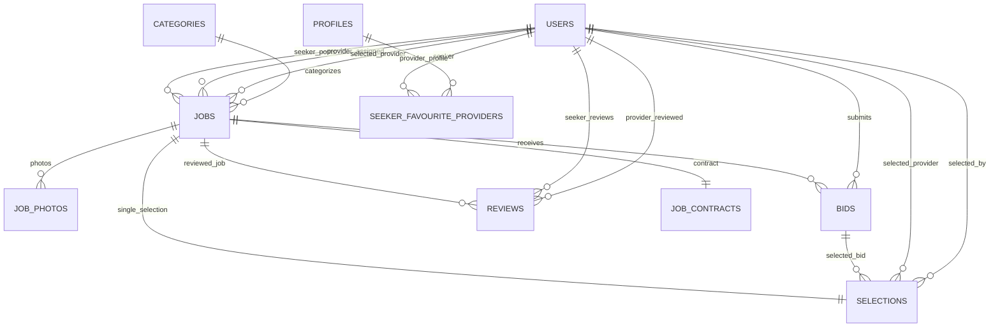

# ERD: Marketplace Core (Entity-Based)

Source: TypeORM entity relations under `apps/api/src/database/entities`.

```mermaid
erDiagram
  USERS ||--o{ JOBS : seeker_posts
  USERS ||--o{ JOBS : provider_assigned
  USERS ||--o{ JOBS : selected_provider
  CATEGORIES ||--o{ JOBS : categorizes
  JOBS ||--o{ JOB_PHOTOS : photos

  JOBS ||--o{ BIDS : receives
  USERS ||--o{ BIDS : submits

  JOBS ||--|| SELECTIONS : single_selection
  BIDS ||--o{ SELECTIONS : selected_bid
  USERS ||--o{ SELECTIONS : selected_provider
  USERS ||--o{ SELECTIONS : selected_by

  JOBS ||--o{ REVIEWS : reviewed_job
  USERS ||--o{ REVIEWS : seeker_reviews
  USERS ||--o{ REVIEWS : provider_reviewed

  USERS ||--o{ SEEKER_FAVOURITE_PROVIDERS : seeker
  PROFILES ||--o{ SEEKER_FAVOURITE_PROVIDERS : provider_profile

  JOBS ||--|| JOB_CONTRACTS : contract
```
