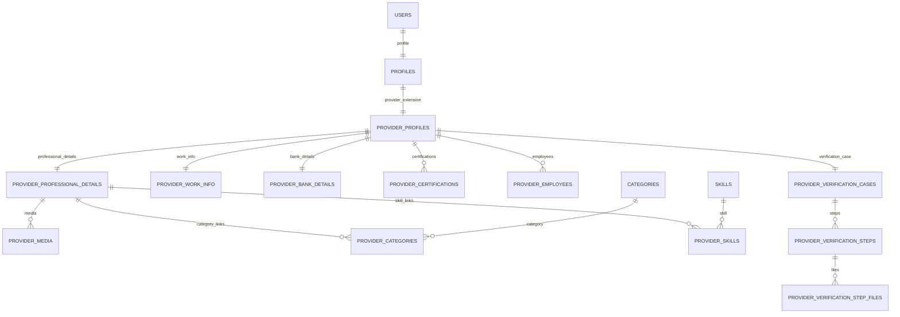

# ERD: Provider Profile and Verification (Entity-Based)

Source: TypeORM entity relations under `apps/api/src/database/entities`.

```mermaid
erDiagram
  USERS ||--|| PROFILES : profile
  PROFILES ||--|| PROVIDER_PROFILES : provider_extension

  PROVIDER_PROFILES ||--|| PROVIDER_PROFESSIONAL_DETAILS : professional_details
  PROVIDER_PROFILES ||--|| PROVIDER_WORK_INFO : work_info
  PROVIDER_PROFILES ||--|| PROVIDER_BANK_DETAILS : bank_details
  PROVIDER_PROFILES ||--o{ PROVIDER_CERTIFICATIONS : certifications
  PROVIDER_PROFILES ||--o{ PROVIDER_EMPLOYEES : employees

  PROVIDER_PROFESSIONAL_DETAILS ||--o{ PROVIDER_MEDIA : media
  PROVIDER_PROFESSIONAL_DETAILS ||--o{ PROVIDER_CATEGORIES : category_links
  PROVIDER_PROFESSIONAL_DETAILS ||--o{ PROVIDER_SKILLS : skill_links

  CATEGORIES ||--o{ PROVIDER_CATEGORIES : category
  SKILLS ||--o{ PROVIDER_SKILLS : skill

  PROVIDER_PROFILES ||--|| PROVIDER_VERIFICATION_CASES : verification_case
  PROVIDER_VERIFICATION_CASES ||--o{ PROVIDER_VERIFICATION_STEPS : steps
  PROVIDER_VERIFICATION_STEPS ||--o{ PROVIDER_VERIFICATION_STEP_FILES : files
```
