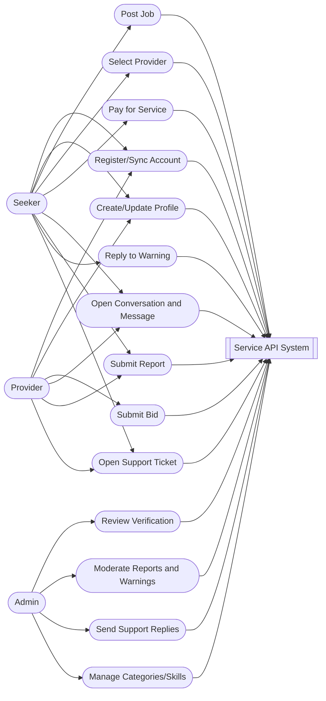

# Use Case Diagram

Mermaid does not have native UML use-case syntax, so this diagram uses flowchart notation with actors and use-cases.

```mermaid
flowchart LR
  Seeker([Seeker])
  Provider([Provider])
  Admin([Admin])
  System[[Service API System]]

  UC1([Register/Sync Account])
  UC2([Create/Update Profile])
  UC3([Post Job])
  UC4([Submit Bid])
  UC5([Select Provider])
  UC6([Pay for Service])
  UC7([Open Conversation and Message])
  UC8([Submit Report])
  UC9([Reply to Warning])
  UC10([Open Support Ticket])
  UC11([Review Verification])
  UC12([Moderate Reports and Warnings])
  UC13([Send Support Replies])
  UC14([Manage Categories/Skills])

  Seeker --> UC1
  Seeker --> UC2
  Seeker --> UC3
  Seeker --> UC5
  Seeker --> UC6
  Seeker --> UC7
  Seeker --> UC8
  Seeker --> UC9
  Seeker --> UC10

  Provider --> UC1
  Provider --> UC2
  Provider --> UC4
  Provider --> UC7
  Provider --> UC8
  Provider --> UC10

  Admin --> UC11
  Admin --> UC12
  Admin --> UC13
  Admin --> UC14

  UC1 --> System
  UC2 --> System
  UC3 --> System
  UC4 --> System
  UC5 --> System
  UC6 --> System
  UC7 --> System
  UC8 --> System
  UC9 --> System
  UC10 --> System
  UC11 --> System
  UC12 --> System
  UC13 --> System
  UC14 --> System
```
